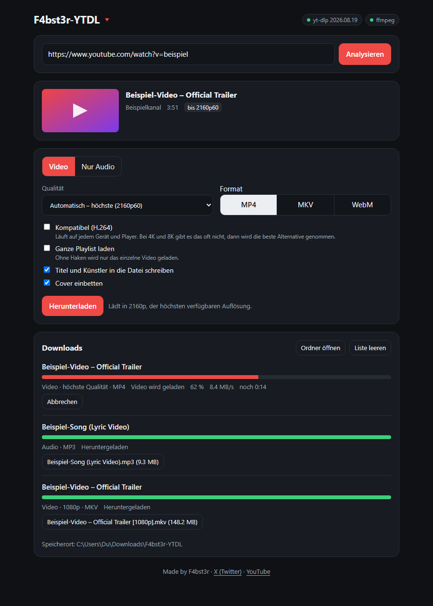
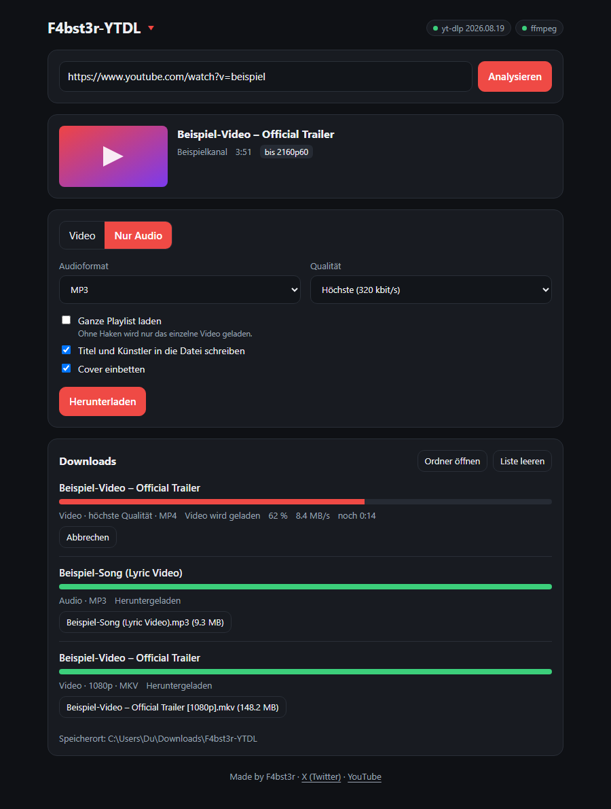

<div align="center">

# F4bst3r-YTDL

**Lokaler Video- und Audio-Downloader mit schöner Weboberfläche**
auf Basis von [yt-dlp](https://github.com/yt-dlp/yt-dlp) und [ffmpeg](https://ffmpeg.org/)


<a href="https://github.com/F4bst3r1337/F4bst3r-YTDL/releases/latest/download/F4bst3r-YTDL.zip"></a>

[Alle Versionen](https://github.com/F4bst3r1337/F4bst3r-YTDL/releases) · [Changelog](CHANGELOG.md)



</div>

> **Hinweis:** Dieses Projekt ist zu 100 % mit Claude (Anthropic) vibe-gecodet. Der gesamte Code wurde von der KI geschrieben und nicht manuell geprüft. Nutzung auf eigene Verantwortung.
>
> **Note:** This project is 100% vibe-coded with Claude (Anthropic). All code was written by the AI and has not been manually reviewed. Use at your own risk.

## Features

- 🎬 **Beste Qualität automatisch:** immer die höchste verfügbare Auflösung bis 8K, oder feste Stufen von 144p bis 4320p
- 📦 **Video als MP4, MKV oder WebM**, optional „Kompatibel (H.264)“ für Geräte, die VP9 oder AV1 nicht abspielen
- 🎵 **Nur Audio** als MP3, M4A, Opus, FLAC, WAV oder unverändertes Original, bei MP3, M4A und Opus mit 128 bis 320 kbit/s
- 🖼️ **Cover und Metadaten** (Titel, Künstler) werden in die Datei eingebettet
- 📃 **Playlists** komplett laden
- ⚡ **Mehrere Downloads gleichzeitig** mit Fortschritt, Geschwindigkeit und Restzeit, jederzeit abbrechbar
- 🔁 **Automatischer zweiter Versuch**, wenn YouTube einen Download-Link ablehnt (HTTP 403)
- 🔑 **Automatische Anmeldung:** verlangt YouTube einen Login, probiert die App die Cookies von Firefox, Chrome, Edge und Brave
- 🧰 **Richtet sich selbst ein:** Python-Umgebung, yt-dlp, ffmpeg und Deno werden beim ersten Start geladen
- 🔒 **Läuft nur lokal:** der Server hört nur auf `127.0.0.1` und verlangt ein Zugangs-Token

## Screenshots

| Video | Nur Audio |
| :---: | :---: |
|  |  |

## Starten

| System | Befehl |
| --- | --- |
| Windows | Doppelklick auf `start.bat` |
| macOS | Doppelklick auf `start.command` |
| Linux | `./start.sh` |

Beim ersten Start richtet das Skript alles selbst ein und lädt dafür einmalig etwa 200 MB. Danach öffnet sich der Browser.
Du kannst auch `index.html` per Doppelklick öffnen, solange das Startfenster läuft. Der Server muss laufen, weil ein Browser allein weder yt-dlp noch ffmpeg ausführen kann.

Das fertige ZIP lädst du über den Download-Button ganz oben oder direkt unter [Releases](../../releases) als `F4bst3r-YTDL.zip`. Entpacken, dann starten.

## Was automatisch eingerichtet wird

| Programm | Wie |
| --- | --- |
| Python | Windows: per `winget`. Linux: über apt, dnf oder pacman (fragt ggf. nach dem Passwort). Mac: über Homebrew, falls vorhanden. |
| yt-dlp | in eine eigene Umgebung im Ordner `.venv` |
| ffmpeg und ffprobe | in den Ordner `bin` (ohne Admin-Rechte, nichts wird im System verändert) |
| Deno (für YouTube) | in den Ordner `bin`, wenn weder Deno noch Node.js vorhanden ist |

Schon vorhandene Programme werden erkannt und nicht doppelt geladen. Zum Aufräumen genügt es, den Ordner zu löschen.
Nicht automatisch geht es, wenn auf dem Windows-PC `winget` fehlt (dann Python von python.org installieren) oder wenn auf dem Mac weder Python noch Homebrew vorhanden sind (dann beim ersten `python3`-Aufruf die Entwicklertools bestätigen).

Dateien landen standardmäßig in `Downloads/F4bst3r-YTDL`, im Browser lassen sie sich zusätzlich direkt speichern.

## Optionen

```
python server.py --dir D:\Videos --port 9000 --parallel 3
python server.py --cookies-from-browser firefox     # Browser für die Anmeldung festlegen
python server.py --no-auto-cookies                  # Browser-Cookies nie automatisch probieren
```

## Anmeldung bei YouTube

Verlangt YouTube eine Anmeldung („Sign in to confirm you're not a bot“ oder Altersabfrage), probiert die App automatisch die Cookies deiner Browser (Firefox, Chrome, Edge, Brave) durch. Dafür musst du in einem davon bei YouTube angemeldet sein. Der Browser, der funktioniert hat, wird bis zum Beenden der App weiterverwendet. Die Cookies werden nur lokal von yt-dlp gelesen und nirgends gespeichert oder gesendet.
Firefox klappt am zuverlässigsten, bei Chrome, Edge und Brave blockiert Windows den Zugriff oft. Mit `--no-auto-cookies` schaltest du das Verhalten ab, mit `--cookies-from-browser firefox` legst du den Browser fest.

## Wenn es nicht mehr klappt

YouTube ändert oft etwas. Dann hilft fast immer ein Update: `start.bat update` bzw. `./start.sh update`.

## Sicherheit

Der Server hört nur auf `127.0.0.1` und verlangt ein Token, das in `config.js` steht. Fremde Webseiten können damit nichts auslösen. Gib `config.js` nicht weiter.

Lade nur Inhalte herunter, für die du die Rechte hast oder deren Nutzung erlaubt ist. Die Nutzungsbedingungen der Plattformen und das Urheberrecht gelten weiterhin.

## Changelog

Alle Änderungen stehen in der [CHANGELOG.md](CHANGELOG.md).

---

<div align="center">

Made by **F4bst3r** · [X (Twitter)](https://x.com/F4bst3r) · [YouTube](https://www.youtube.com/@F4bst3r1)

</div>
